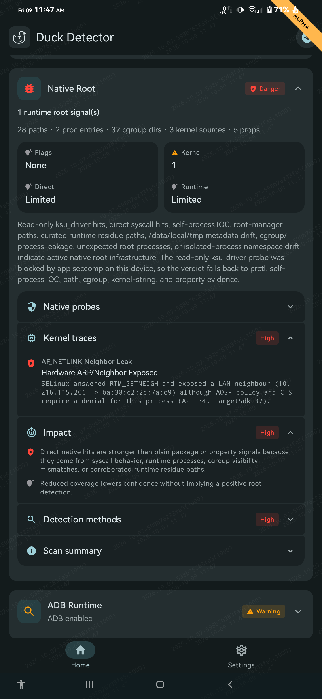
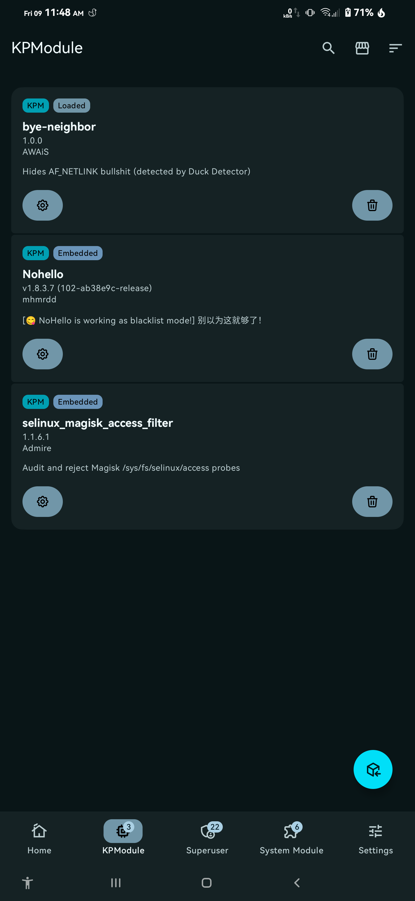
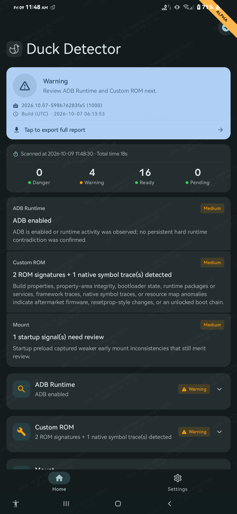

# AF_NETLINK-reject-kpm
KernelPatch module to hide AF_NETLINK (Hardware ARP/Neighbor) (RTM_GETNEIGH/RTM_GETLINK) leaks

---

description:
-
this module rejects AF_NETLINK for `untrusted_apps` (UID 10000 to 19999)

<p align="center">
  
  
  
</p>

---
how to compile:
-
### clone
```
git clone https://github.com/AwaisKing/AF_NETLINK-reject-kpm
cd AF_NETLINK-reject-kpm
git submodule update --init --recursive
```
#### (( TO BUILD FOR SPECIFIC ARCH READ NOTES ))

### build KPM module:
```
.../AF_NETLINK-reject-kpm> make
```

### build neighbor leak tester:
```
.../AF_NETLINK-reject-kpm/neighbor_tester> make
```

### if phone isn't connected, just run these commands in `neighbor_tester` folder
```
.../AF_NETLINK-reject-kpm/neighbor_tester> make no_check

adb push test_neighbor /data/local/tmp/
adb shell "chmod +x /data/local/tmp/test_neighbor"
adb shell "/data/local/tmp/test_neighbor"
```

---

## NOTES:
look for `aarch64-linux-android34` in `Makefile`s (command `grep -r aarch64-linux-android34`) and adjust according to your device/architecture

## CREDITS:
1. [@LyraVoid for KernelPatch](https://github.com/LyraVoid/KernelPatch)
2. [@eltavine for Duck-Detector-Refactoring](https://github.com/eltavine/Duck-Detector-Refactoring)
3. Google & llama.cpp for AI
